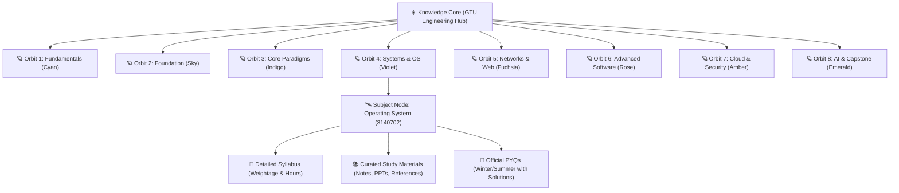

<div align="center">

  <!-- Floating Animated Logo / Header -->
  <a href="https://studyverse-bay.vercel.app" target="_blank">
    
  </a>

  <br />

  <!-- Animated Typing Tagline -->
  <a href="https://studyverse-bay.vercel.app">
    
  </a>

  <p align="center">
    <strong>A high-performance, studio-grade academic platform built for Gujarat Technological University (GTU) B.E./B.Tech engineering students.</strong>
  </p>

  <!-- Shields & Badges Grid -->
  <p align="center">
    <a href="https://studyverse-bay.vercel.app" target="_blank">
      
    </a>
    <a href="https://github.com/darshil158/StudyVerse/blob/main/LICENSE">
      
    </a>
    
    
  </p>

  <p align="center">
    
    
    
    
    
    
    
  </p>

  <!-- Quick Action Buttons -->
  <p align="center">
    <a href="https://studyverse-bay.vercel.app"><b>Explore Live Platform ➔</b></a> •
    <a href="#-the-knowledge-universe"><b>Cosmic Architecture</b></a> •
    <a href="#-8-semester-galaxy-matrix"><b>Curriculum Matrix</b></a> •
    <a href="#-quick-start--local-setup"><b>Quick Start</b></a> •
    <a href="#-supabase-database-setup"><b>Database Schema</b></a>
  </p>

</div>

---

> [!IMPORTANT]
> **Zero Template Policy**: StudyVerse is handcrafted from scratch as an award-level academic product. It is **NOT** a marketplace, contains **zero commercial ads**, and provides **instant offline fallback** if disconnected from the cloud.

---

## 🌌 The Knowledge Universe

Traditional academic portals rely on boring nested folders or cluttered e-commerce designs. **StudyVerse** reimagines the engineering curriculum as an interactive **Cosmic Galaxy**:



* **Interactive 3D Knowledge Core**: Built using `@react-three/fiber` & Three.js with soft bloom post-processing, rotating orbital rings, and dynamic celestial bodies.
* **Command Palette (<kbd>Ctrl</kbd> + <kbd>K</kbd>)**: Instant fuzzy lookup across all 48 subjects, lecture notes, syllabus units, and question papers.
* **In-App Document Reader & Download Engine**: Built-in modal viewer with instant downloads and custom animated cosmic toasts.
* **Resilient Dual-Engine Backend**: Seamlessly queries live PostgreSQL tables on **Supabase** while automatically falling back to comprehensive static datasets if offline.

---

## 🪐 8-Semester Galaxy Matrix

Every semester possesses a calibrated orbital signature, glow frequency, and curated courses:

| Orbit | Semester | Theme Hue | Hex Accent | Core Focus Area | Subject Count |
| :---: | :--- | :---: | :---: | :--- | :---: |
| **01** | **Semester 1** | Cyan | `#06b6d4` | Mathematics I, Physics, Basic Electrical, Elements of Mechanical | **6 Subjects** |
| **02** | **Semester 2** | Sky | `#0ea5e9` | Mathematics II, Programming in C, Basic Electronics, Civil Eng. | **6 Subjects** |
| **03** | **Semester 3** | Indigo | `#6366f1` | Data Structures, Digital Logic Design, Database Management (DBMS) | **6 Subjects** |
| **04** | **Semester 4** | Violet | `#8b5cf6` | Operating Systems, Computer Organization, Discrete Math, OOP | **6 Subjects** |
| **05** | **Semester 5** | Fuchsia | `#d946ef` | Computer Networks, Software Engineering, Analysis of Algorithms (DAA) | **6 Subjects** |
| **06** | **Semester 6** | Rose | `#f43f5e` | Advanced Java, Web Technologies, Theory of Computation (TOC) | **6 Subjects** |
| **07** | **Semester 7** | Amber | `#f59e0b` | Cloud Computing, Compiler Design, Information & Cyber Security | **6 Subjects** |
| **08** | **Semester 8** | Emerald | `#10b981` | Artificial Intelligence, Machine Learning, Major Capstone Project | **6 Subjects** |

---

## ⚡ Keyboard Shortcuts & Power Features

Navigate StudyVerse at lightspeed using intuitive global keybindings:

| Shortcut | Action | Description |
| :---: | :--- | :--- |
| <kbd>Ctrl</kbd> + <kbd>K</kbd> / <kbd>⌘</kbd> + <kbd>K</kbd> | **Command Palette** | Opens the cosmic instant search modal from anywhere |
| <kbd>Esc</kbd> | **Close Overlay** | Dismisses Command Palette, Document Viewer, or Modals |
| <kbd>↑</kbd> <kbd>↓</kbd> | **Navigate Results** | Cycle through search results smoothly |
| <kbd>Enter</kbd> | **Select Item** | Jump directly to selected subject, material, or question paper |

---

## 🛠️ Tech Stack & Architecture

```
┌────────────────────────────────────────────────────────────────────────┐
│                              FRONTEND                                  │
│   React 18  •  Vite  •  Tailwind CSS v3  •  Framer Motion  •  R3F      │
└────────────────────────────────────┬───────────────────────────────────┘
                                     │
                                     ▼
┌────────────────────────────────────────────────────────────────────────┐
│                           DATA RESOLVER                                │
│   src/services/api.js ──> Supabase Client ──> Fallback Data Store      │
└──────────────────┬─────────────────────────────────┬───────────────────┘
                   │                                 │
                   ▼ (Online & Configured)           ▼ (Offline / Local)
┌─────────────────────────────────────┐   ┌──────────────────────────────┐
│          SUPABASE POSTGRES          │   │      STATIC CURRICULUM       │
│  6 Tables: semesters, subjects,     │   │   All 48 Subjects, Units,    │
│  syllabus_units, materials, pyqs    │   │   Notes & Question Papers    │
└─────────────────────────────────────┘   └──────────────────────────────┘
```

* **Frontend**: React 18 (JSX), Vite 5, Tailwind CSS v3, React Router DOM v6
* **3D Graphics & Visuals**: Three.js, `@react-three/fiber`, `@react-three/drei`, `@react-three/postprocessing` (Selective Bloom)
* **Animation & Micro-interactions**: Framer Motion layout animations, glassmorphism, spring modals
* **Backend & Cloud Database**: Supabase PostgreSQL, Row Level Security (RLS) policies, storage buckets
* **Hosting**: Vercel (Production SPA with `vercel.json`), Render compatible

---

## 🚀 Quick Start & Local Setup

StudyVerse runs **out-of-the-box in under 2 minutes with ZERO required API keys**:

### 1. Clone the Repository
```bash
git clone https://github.com/darshil158/StudyVerse.git
cd StudyVerse
```

### 2. Install Dependencies
```bash
npm install
```

### 3. Launch Development Server
```bash
npm run dev
```
Open **[http://localhost:5173](http://localhost:5173)** in your browser.

### 4. Build for Production
```bash
npm run build
npm run preview
```

---

## 🗄️ Supabase Database Setup

<details>
<summary><b>Click to expand Supabase database configuration details</b></summary>
<br />

StudyVerse includes full PostgreSQL DDL and seed scripts in `supabase/`:

### Step 1: Execute Schema Migration
Run [`supabase/migrations/001_schema.sql`](supabase/migrations/001_schema.sql) in your Supabase SQL Editor:
- Creates `semesters`, `subjects`, `syllabus_units`, `categories`, `materials`, and `pyqs` tables.
- Enables Row Level Security (RLS) with public read access.

### Step 2: Seed GTU Data
Run [`supabase/seed/seed.sql`](supabase/seed/seed.sql) in your Supabase SQL Editor:
- Populates all 8 engineering semesters.
- Populates all 48 GTU engineering subjects with course codes, credits, and syllabus units.
- Populates sample high-yield lecture notes and solved PYQs.

### Step 3: Connect Environment Variables
Create a `.env` file in the project root:
```env
VITE_SUPABASE_URL=https://your-project.supabase.co
VITE_SUPABASE_ANON_KEY=your-anon-public-key
```

</details>

---

## 🌐 Deployment

<details>
<summary><b>Deploying to Vercel (Recommended)</b></summary>
<br />

1. Push your repository to GitHub.
2. Sign in to [Vercel](https://vercel.com) and import `StudyVerse`.
3. Add your environment variables:
   - `VITE_SUPABASE_URL`: `https://your-project.supabase.co`
   - `VITE_SUPABASE_ANON_KEY`: `your-anon-public-key`
4. Click **Deploy**. Vercel will build and deploy automatically using [`vercel.json`](vercel.json).

</details>

<details>
<summary><b>Deploying to Render (Static Site)</b></summary>
<br />

1. Go to [Render Dashboard](https://dashboard.render.com/) ➔ **New +** ➔ **Static Site**.
2. Select repository `darshil158/StudyVerse`.
3. Configure settings:
   - **Build Command**: `npm run build`
   - **Publish Directory**: `dist`
4. Under **Redirects/Rewrites**, add:
   - **Source**: `/*` ➔ **Destination**: `/index.html` (Action: `Rewrite`)
5. Click **Create Static Site**.

</details>

---

## 📂 Repository File Structure

<details>
<summary><b>Click to expand the complete file tree</b></summary>
<br />

```
StudyVerse/
├── .env.example                     # Environment variables template
├── vercel.json                      # Vercel SPA client-side rewrite config
├── package.json                     # Project manifest and scripts
├── vite.config.js                   # Vite config with split chunk optimization
├── tailwind.config.js               # Color tokens, semester themes, glow shadows
├── postcss.config.js                # Tailwind & Autoprefixer
├── index.html                       # HTML5 entry with Space Grotesk / Inter fonts
├── supabase/
│   ├── migrations/
│   │   └── 001_schema.sql           # Complete PostgreSQL DDL schema & RLS
│   └── seed/
│       └── seed.sql                 # Complete curriculum & materials seed data
├── src/
│   ├── main.jsx                     # React DOM entry
│   ├── App.jsx                      # Shell, Router & Toast provider
│   ├── index.css                    # Tailwind directives & cosmic utility styles
│   ├── lib/
│   │   ├── supabase.js              # Supabase client with auto URL sanitizer
│   │   └── utils.js                 # Helpers, color tokens & formatters
│   ├── data/                        # Static offline fallback datasets
│   │   ├── semesters.js             # 8 Semesters orbital definitions
│   │   ├── subjects.js              # 48 GTU engineering subjects
│   │   ├── syllabus_units.js        # Detailed syllabus units breakdown
│   │   ├── materials.js             # Curated lecture notes & slide decks
│   │   ├── pyqs.js                  # GTU previous year question papers
│   │   ├── categories.js            # Subject category taxonomies
│   │   └── stats.js                 # Platform metrics for Bento Grid
│   ├── services/
│   │   ├── api.js                   # Dual-engine API (Supabase + Local Fallback)
│   │   └── download.js              # Document view & download handlers
│   ├── hooks/                       # Custom data fetching & UI hooks
│   │   ├── useSemesters.js          # Semester catalog hook
│   │   ├── useSubjects.js           # Subjects query hook
│   │   ├── useSubject.js            # Single subject deep-dive hook
│   │   ├── useMaterials.js          # Study resources hook
│   │   ├── useSyllabus.js           # Syllabus units hook
│   │   ├── usePYQs.js               # Question papers hook
│   │   ├── useSearch.js             # Global fuzzy search hook
│   │   ├── useDebounce.js           # Input debounce hook
│   │   └── useToast.jsx             # Toast notification state hook
│   ├── components/
│   │   ├── 3d/                      # Three.js 3D Visual Experience
│   │   │   ├── Hero3D.jsx           # Code-split Canvas container
│   │   │   ├── KnowledgeCoreScene.jsx # Central star + 8 planetary orbits
│   │   │   └── Hero3DFallback.jsx   # Lightweight CSS/SVG 2D fallback
│   │   ├── common/                  # Reusable UI component library
│   │   │   ├── CommandPalette.jsx   # Ctrl+K modal with grouped results
│   │   │   ├── Modal.jsx            # Document preview modal
│   │   │   ├── Toast.jsx            # Cosmic spring toast notification
│   │   │   ├── Logo.jsx             # Animated SVG monogram
│   │   │   ├── Tabs.jsx             # Framer Motion animated tabs
│   │   │   ├── SearchBar.jsx        # Search input with icon
│   │   │   ├── Skeleton.jsx         # Loading skeleton blocks
│   │   │   └── EmptyState.jsx       # Deep space empty state
│   │   └── layout/                  # Master navigation & shell
│   │       ├── Navbar.jsx           # Sticky glassmorphic navbar with search
│   │       ├── Footer.jsx           # Platform credits & university notice
│   │       └── Layout.jsx           # Top-level viewport shell
│   └── pages/                       # Application route views
│       ├── HomePage.jsx             # 3D Hero, Bento grid, quick track
│       ├── SemestersPage.jsx        # 8-Semester orbital galaxy grid
│       ├── SemesterDetailPage.jsx   # 6 subjects for selected semester
│       ├── SubjectDetailPage.jsx    # Complete subject hub (Syllabus/Notes/PYQs)
│       ├── MaterialsPage.jsx        # All materials filter repository
│       ├── PYQsPage.jsx             # All question papers filter repository
│       ├── AboutPage.jsx            # Philosophy, FAQ & engineering ethos
│       └── NotFoundPage.jsx         # 404 Lost in Space interactive view
└── README.md
```

</details>

---

## 🤝 Contributing

Contributions to improve GTU syllabus accuracy, add verified notes, or enhance 3D effects are warmly welcome!

1. Fork the Project (`https://github.com/darshil158/StudyVerse/fork`)
2. Create your Feature Branch (`git checkout -b feature/CosmicFeature`)
3. Commit your Changes (`git commit -m 'feat: add semester 6 advanced notes'`)
4. Push to the Branch (`git push origin feature/CosmicFeature`)
5. Open a Pull Request

---

## 📜 Disclaimer & License

* **Academic Independence**: StudyVerse is an independent, student-led open educational platform. Gujarat Technological University (GTU) and all official course titles, syllabi, and codes are the intellectual property of Gujarat Technological University.
* **License**: Distributed under the **MIT License**. See `LICENSE` for details.

---

<div align="center">

  <p><b>Crafted with 💙 for every GTU Engineering Student</b></p>
  
  <a href="https://studyverse-bay.vercel.app">
    
  </a>

  <br/><br/>
  <sub>© 2026 StudyVerse. Free forever. No ads. No paywalls.</sub>

</div>
